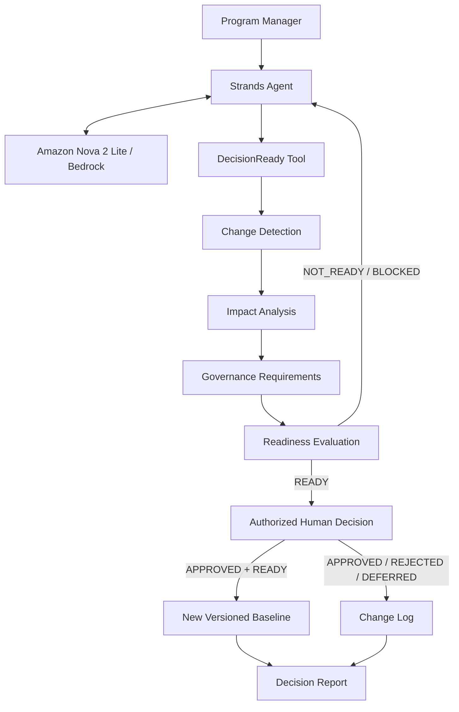

# DecisionReady Architecture

DecisionReady separates AI reasoning, deterministic governance, and human authority.

## Architecture

## Trust Boundary
**AI:** Strands + Nova explain and orchestrate.
**DecisionReady:** deterministic rules own readiness, evidence, approvals, blockers, and baseline promotion.
**Human:** READY does not mean APPROVED. Only an authorized human can approve the change.

## Germany Demo
Baseline v12 -> NOT_READY -> governance satisfied -> READY -> human APPROVED -> baseline v13.
