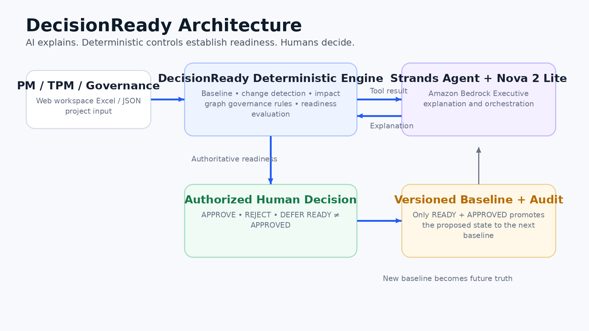
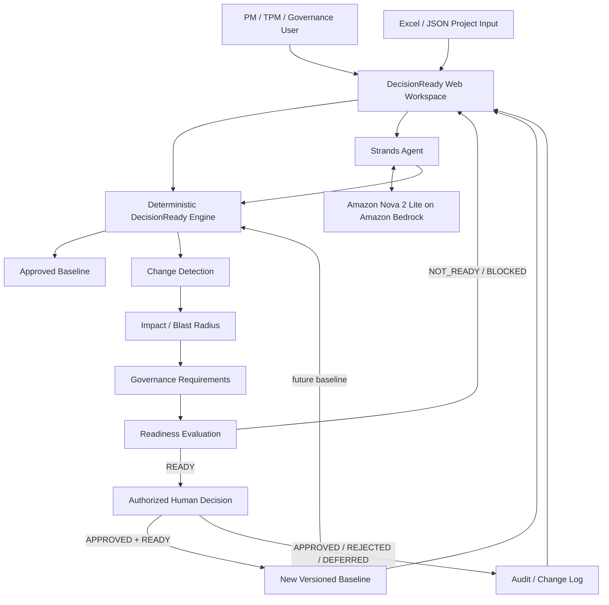

# DecisionReady Architecture

DecisionReady deliberately separates AI explanation, deterministic governance, and human authority.



## Agent and System Flow



## Strands Agent Loop

The Strands agent receives a user request for an executive explanation and calls the DecisionReady analysis tool before making a readiness statement. The tool returns authoritative deterministic results. Amazon Nova 2 Lite then explains those results in executive language.

The language model is not the source of truth for readiness.

## Trust Boundary

**AI - Strands + Nova**

- Orchestrates the explanation flow
- Calls the DecisionReady analysis tool
- Explains detected changes, impacts, evidence, approvals, blockers, readiness, and next actions
- Cannot override authoritative readiness
- Cannot make the final approval decision

**DecisionReady deterministic engine**

- Owns baseline comparison
- Detects field-level changes
- Maps impacts to governed domains
- Derives evidence and approval requirements
- Evaluates `READY`, `NOT_READY`, or `BLOCKED`
- Enforces baseline promotion rules

**Human authority**

- Supplies evidence sources and named approvers
- Makes the final `APPROVED`, `REJECTED`, or `DEFERRED` decision
- `READY` does not mean `APPROVED`
- Only `READY + APPROVED` creates a new baseline

## AWS Services and Runtime

- Amazon Bedrock - model runtime
- Amazon Nova 2 Lite - explanation model
- AWS Elastic Beanstalk - public application hosting
- Strands Agents SDK - agent/tool orchestration
- Streamlit - browser UI

## Demo Lifecycle

```text
Approved Baseline v1
        ↓
Proposed Change
        ↓
NOT_READY
        ↓
Evidence + Human Approvals Satisfied
        ↓
READY
        ↓
Authorized Human APPROVED
        ↓
New Governed Baseline v2
        ↓
Audit Record / Decision Report
```
